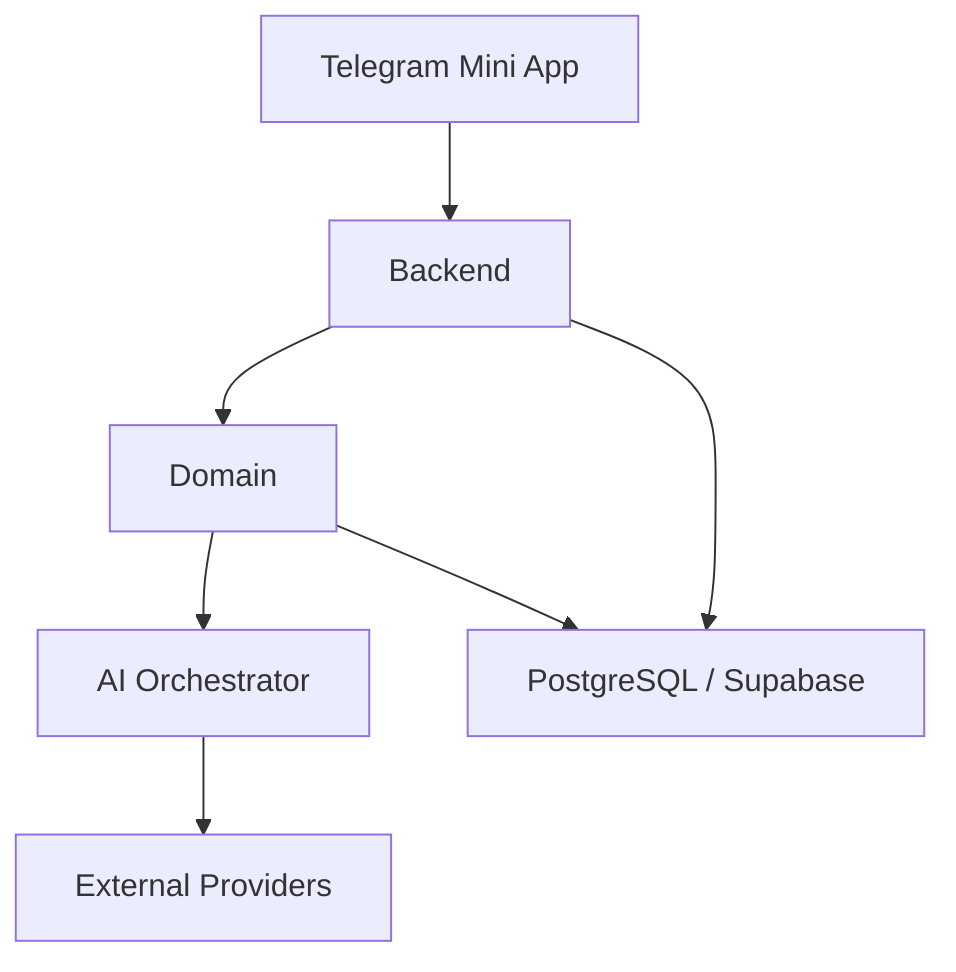

# Backend architecture

> Статус: target architecture. В `develop` реализованы FastAPI, server-side Telegram Auth, часть persistence и HTTP contracts; отдельный AI Orchestrator, external providers, RLS и realtime ещё не реализованы. AI отложен до подключения второго разработчика.

## Назначение документа

Этот документ фиксирует высокоуровневую backend-архитектуру Travel Friend после завершения логической доменной модели. Он не задаёт API-контракты, схему БД, RLS, persistence-слой или realtime-реализацию.

## Верхнеуровневый контур

Логика ответственности идёт сверху вниз так:

`Telegram Mini App`
↓
`Backend`
↓
`Domain`
↓
`AI Orchestrator`
↓
`External Providers`
↓
`PostgreSQL / Supabase`

## Зоны ответственности

### Telegram Mini App

Frontend отвечает за:

- UI и пользовательские сценарии `Profile → Discover → Chats → Trips`;
- сбор пользовательского ввода;
- передачу raw `initData` и пользовательских команд на backend;
- отображение backend-состояния, proposal-ов, summary и внешних offer-ов.

Frontend не отвечает за:

- доверенную аутентификацию;
- применение доменных инвариантов;
- доступ к секретам;
- прямые вызовы внешних AI/travel API;
- принятие решений о составе поездки, match, proposal и usage.

### Backend

Backend является единственной доверенной точкой исполнения. Он отвечает за:

- серверную проверку Telegram `initData`;
- авторизацию и контроль доступа;
- маршрутизацию пользовательских команд;
- orchestration между frontend, domain, AI и storage;
- allowlist/redirect политику для внешних ссылок;
- quota, entitlement и usage accounting;
- запись доменного состояния и технических артефактов.

Backend не должен переносить продуктовую логику в frontend и не должен делегировать принятие доменных решений AI-модели.

### Domain

Domain — это слой правил и инвариантов. Он отвечает за:

- `Like → Match → Chat`;
- direct/group chat правила;
- lifecycle поездки;
- голосование по proposal;
- review после изменения состава;
- ограничения на membership, версии и атомарное подтверждение.

Именно domain-слой определяет, можно ли выполнить действие, а не транспортный слой API и не AI-слой.

### AI Orchestrator

AI Orchestrator — это отдельный backend-компонент, который:

- собирает контекст из `Chat`, `Trip`, `ChatSummary` и domain-state;
- создаёт и ведёт `AIRequest`;
- инициирует `Proposal` и `ExternalAPIRequest`;
- обновляет `ChatSummary`;
- проверяет usage/premium-права перед запуском AI;
- возвращает структурированный результат обратно в domain/backend.

AI Orchestrator не имеет права:

- напрямую менять `Trip`;
- создавать участников чата или поездки;
- самостоятельно применять `Proposal`;
- получать application secrets в prompt-контекст;
- иметь прямой HTTP-доступ в обход backend-интеграций.

### External Providers

External Providers — это не часть доверенного ядра. Это внешние сервисы, которые backend вызывает контролируемо:

- LLM provider для summary и proposal generation;
- flight/travel providers для transport и price discovery;
- hotel/lodging providers для ценового и destination enrichment;
- maps/geodata providers для place context;
- affiliate partners для monetized outbound offers.

Все ответы этих provider-ов считаются внешними данными, проходят нормализацию и не могут напрямую менять подтверждённое состояние поездки.

### PostgreSQL / Supabase

PostgreSQL / Supabase — это system of record для:

- доменных сущностей;
- технических AI- и external-request сущностей;
- usage/entitlement данных;
- audit/security артефактов, когда соответствующий этап будет реализован.

База данных хранит состояние, но не заменяет domain-слой как источник бизнес-правил.

## Разделение ответственности по слоям

### Frontend

- отображает;
- отправляет команды;
- не доверяется как security boundary.

### Backend

- проверяет;
- разрешает или отклоняет действие;
- оркестрирует все доверенные операции.

### AI

- анализирует;
- предлагает;
- суммирует;
- не принимает окончательное решение.

### База данных

- хранит подтверждённое и техническое состояние;
- не определяет бизнес-логику сама по себе.

## Что сознательно не описывается здесь

Этот документ намеренно не проектирует:

- PostgreSQL schema;
- таблицы БД;
- миграции;
- API;
- RLS;
- persistence-слой;
- realtime.

Эти этапы должны опираться на утверждённую логическую доменную модель, а не подменять её.
