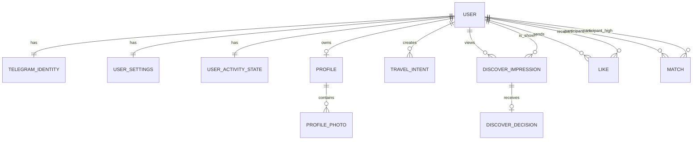
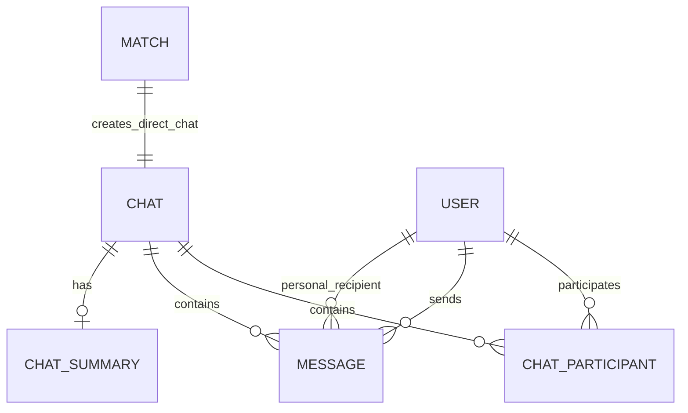
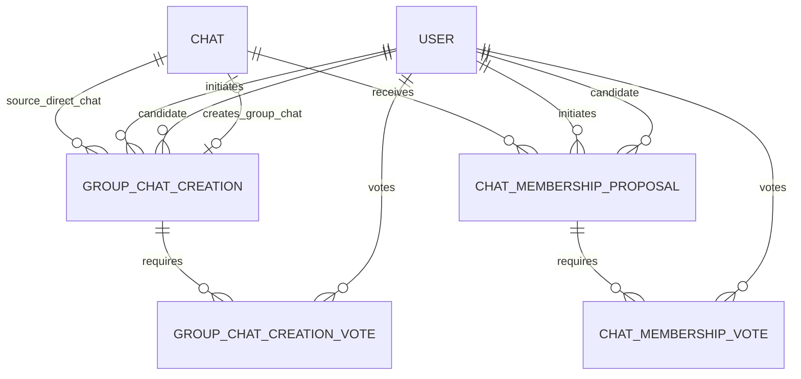
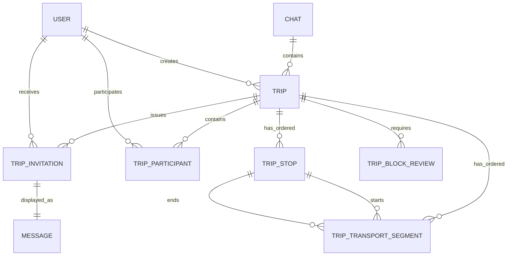
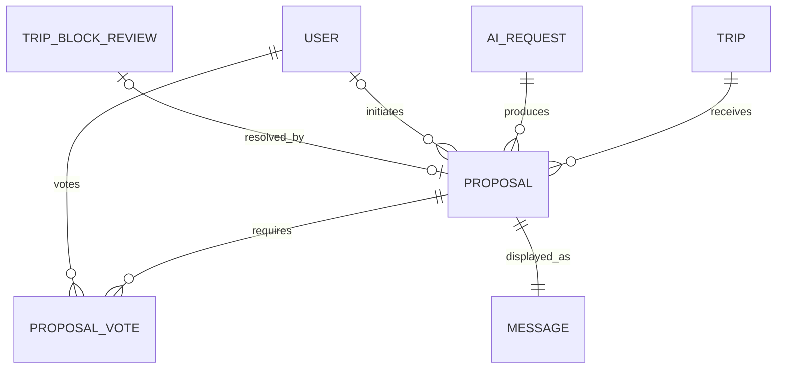
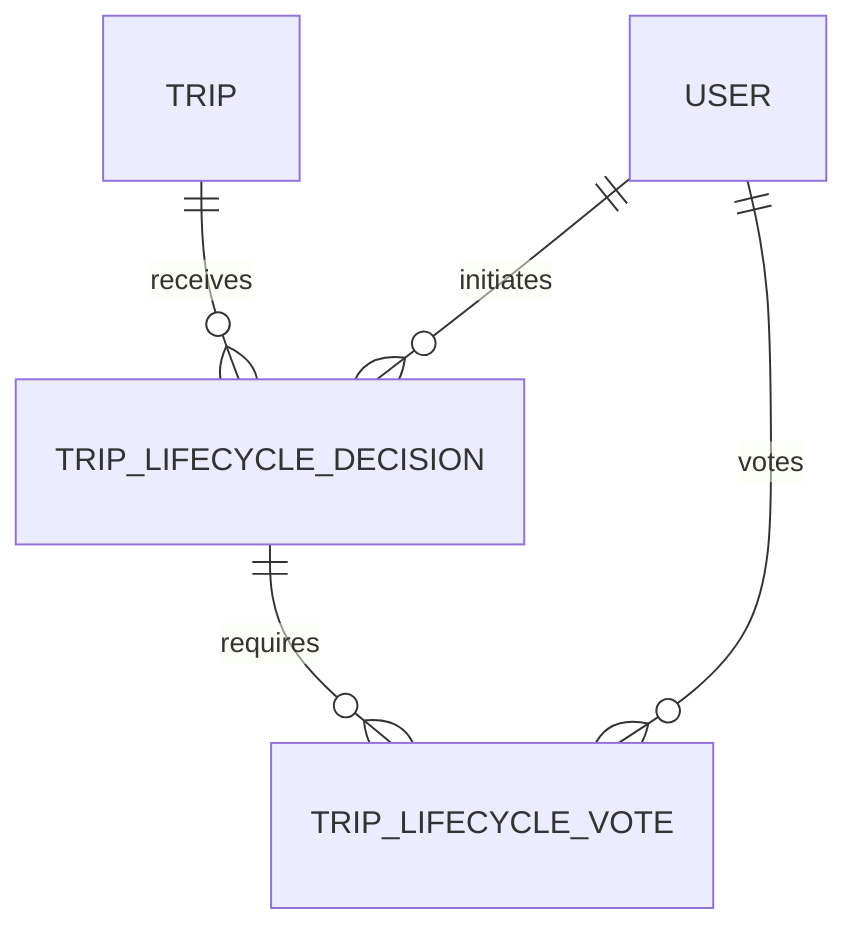
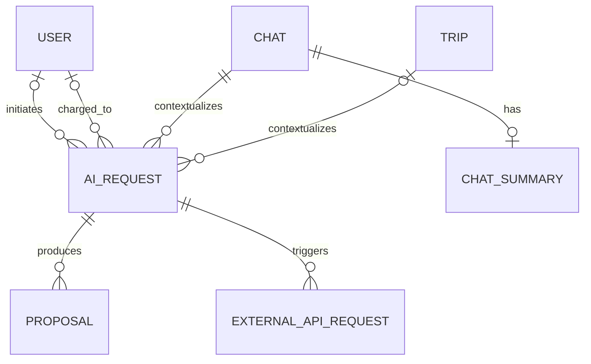
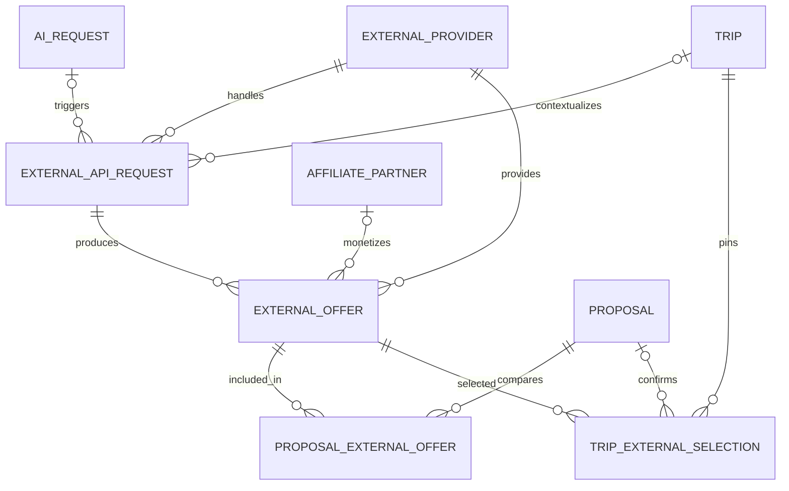
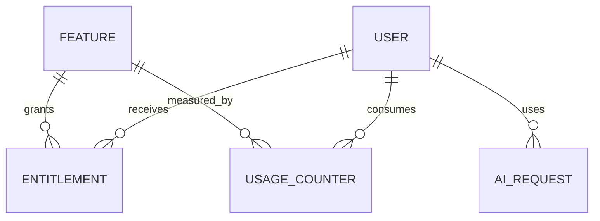

# ER-диаграмма

> Статус: утверждённая logical ER design, а не физическая schema и не описание current direct-chat MVP. В текущей реализации TripInvitation/group lifecycle/Proposal/AI отсутствуют; Trip из direct Chat сразу получает обоих ChatParticipant как TripParticipant.

Этот документ переносит утверждённую ER-модель Travel Friend практически без изменений. Она остаётся источником истины для логической доменной модели и последующих backend-этапов.

## 1. Identity, Profile и Discover

Ключевые правила:

User 1:1 TelegramIdentity
User 1:1 UserSettings
User 1:1 UserActivityState
User 1:0..1 Profile
Profile 1:0..N ProfilePhoto
User 1:0..N TravelIntent

Like — направленное действие User A → User B.
Для одного направления существует максимум один Like.
Like нельзя отменить вручную.

Match создаётся только после встречных Like.
Для пары пользователей существует максимум один Match.
Пара пользователей хранится в каноническом порядке.

`UserActivityState` содержит:

`last_app_activity_at`
`last_discover_opened_at`

`last_discover_opened_at` пока остаётся временным решением для агрегированного сигнала входящего Like. После обсуждения Discover с командой модель просмотра может измениться.

## 2. Chat и сообщения

Direct Chat:

Match 1:1 direct Chat.
Direct Chat содержит ровно двух участников.
Direct Chat нельзя расширить третьим участником.
Завершение Trip не закрывает Chat.

Group Chat:

Group Chat начинается с трёх участников.
Верхнего продуктового ограничения количества участников нет.
Последующие участники добавляются в существующий Group Chat.

`ChatParticipant` хранит, в частности:

`joined_at`
`left_at`
`hidden_at`
`last_read_sequence`
`last_visible_message_sequence`
`left_after_sequence`

Непрочитанный Chat определяется персонально:

`last_visible_message_sequence > last_read_sequence`

`Message`:

Принадлежит Chat, а не Trip.
Имеет `sequence_number`, уникальный внутри Chat.
Может быть общим или персональным system message.
Пользователь создаёт только обычные сообщения от своего имени.
System messages создаёт только backend.
В MVP сообщения не редактируются и физически не удаляются.

## 3. Создание и расширение Group Chat

Первый Group Chat:

Direct Chat двух пользователей
→ предложение добавить третьего
→ единогласие обоих участников
→ отдельное согласие кандидата
→ создание нового Group Chat из трёх участников

Исходный direct Chat остаётся.

Расширение существующего Group Chat:

Один из участников предлагает кандидата.
Кандидат должен иметь Match хотя бы с одним текущим участником.
Все текущие участники голосуют.
Кандидат отдельно принимает приглашение.
После единогласия создаётся новый ChatParticipant в том же Chat.

В `GroupChatCreation` и `ChatMembershipProposal` хранится:

`candidate_user_id`
`candidate_response`
`candidate_responded_at`
`base_membership_version`

Кандидат не считается одним из голосующих участников.

Одновременно в одном Chat допускается только одно активное предложение добавления пользователя.

## 4. Trip и состав участников

Lifecycle:

`forming → active → completed`
`forming → active → cancelled`

`forming`:

Trip создана.
Всем текущим ChatParticipant отправлены персональные TripInvitation.
Состав ещё не зафиксирован.

Принятие приглашения:

TripInvitation accepted
→ создаётся TripParticipant

После явного действия «Начать планирование»:

проверяется минимум два согласившихся участника
→ оставшиеся pending TripInvitation отменяются
→ состав фиксируется
→ Trip становится active

После `active` новых участников добавить нельзя.

Ограничения:

Один Chat содержит несколько последовательных Trip.
Одновременно в одном Chat может быть только одна незавершённая Trip.
Trip может стартовать минимум с двумя участниками.
ChatParticipant и TripParticipant — разные сущности.

После выхода пользователя из Trip:

TripParticipant.left_at заполняется
membership_version увеличивается
все pending Proposal отменяются
создаются TripBlockReview
budget всегда требует пересмотра

Если остаётся меньше двух активных участников, Trip автоматически становится `cancelled`.

## 5. Подтверждённое состояние Trip

Подтверждённые aggregate blocks относятся к `Trip`:

`destination`
`dates`
`budget`
`transport`

Участники хранятся через `TripParticipant`.

`destination` — aggregate route block, а не одно scalar destination. Подтверждённый route состоит из ordered `TripStop`: когда destination block имеет статус `confirmed`, у Trip есть `1..N` stops. `destination_version` и `destination_status` относятся ко всему route/stops plan.

`transport` — aggregate transport block. `TripTransportSegment` принадлежит одной Trip, связывает две `TripStop` той же Trip и образует ordered transport plan. Одна Trip может иметь несколько transport segments; `transport_version` и `transport_status` относятся ко всему transport plan, а не к отдельному segment.

Правило:

`NULL` = блок ещё не подтверждён
`value` = подтверждённое всеми значение

Промежуточные варианты и состояние голосования в Trip не хранятся.

Версии:

`state_version`
`membership_version`
`destination_version`
`dates_version`
`budget_version`
`transport_version`

Отдельные версии блоков позволяют одновременно голосовать по разным разделам.

Бюджет:

`budget_min`
`budget_max`
`budget_currency`
`budget_scope`:

- `per_person`
- `group_total`

После изменения состава бюджет всегда получает обязательный review.

## 6. Proposal и голосование

Типы Proposal MVP:

`update_destination`
`update_dates`
`update_budget`
`update_transport`

Статусы:

`pending`
`accepted`
`rejected`
`cancelled`
`expired`
`stale`

Происхождение:

`origin`:

- `user_ai_request`
- `membership_review`

`initiated_by_user_id` nullable:

- обязателен для обычного пользовательского AI-вызова;
- отсутствует для системного анализа после изменения состава.

При создании Proposal заранее создаются `ProposalVote` для всех активных TripParticipant:

`vote = NULL`

Правила:

Каждый участник голосует один раз.
Голос изменить нельзя.
Инициатор AI-вызова тоже обязан голосовать.
Любой reject завершает Proposal.
Accepted требует единогласия.
Trip не меняется до accepted.
Принятие Proposal и изменение Trip выполняются атомарно.

Параллельность:

Одновременно разрешены Proposal по разным блокам.
На один блок допускается максимум один pending Proposal.

Для MVP Proposal остаётся на уровне одного aggregate Trip block: destination Proposal заменяет route/stops plan целиком, transport Proposal — transport plan целиком. Stop-level и segment-level Proposal не вводятся. Обычный `accept`/`reject` Proposal содержит один заранее выбранный вариант, поэтому multi-choice/ranked voting отсутствует.

## 7. TripBlockReview

TripBlockReview:

- `trip`
- `block_type`
- `trigger`
- `status`
- `resolved_by_proposal`

Статусы:

`pending_analysis`
`review_required`
`resolved`
`cancelled`

После изменения состава:

`budget` → `review_required` сразу

`destination`
`dates`
`transport`
→ `pending_analysis`
→ AI определяет `unaffected` или `needs_review`

Если блок не затронут, review закрывается.

Если затронут, создаётся новый Proposal.

Подтверждённое значение при этом автоматически не очищается.

## 8. Lifecycle-решения Trip

Для MVP через эту сущность поддерживается: `cancel_trip`

Ручная отмена активной Trip требует единогласия всех активных участников.

Изменение состава отменяет незавершённое голосование.

Завершение Trip работает иначе:

Если подтверждённая `end_date` уже прошла,
любой активный TripParticipant может завершить Trip единолично.

Досрочное ручное завершение в MVP не поддерживается.

## 9. AI и ChatSummary

`AIRequest` — техническая сущность без пользовательского экрана истории.

Тип запуска:

`trigger_type`:

- `user`
- `system`
- `scheduled`

Учёт использования:

`usage_scope`:

- `user_quota`
- `system`
- `promotional`

Для `user_quota` обязателен `charged_to_user_id`.

Системные процессы не расходуют пользовательскую квоту.

AI может:

создать один или несколько Proposal
обновить ChatSummary
проанализировать изменение состава
найти варианты через внешние API
завершиться без Proposal

AI не может:

напрямую менять Trip
создавать участников
самостоятельно применять Proposal
иметь прямой HTTP-доступ
получать секреты приложения

## 10. Внешние API и предложения

`ExternalOffer` — временный snapshot:

`provider`
`external_id`
`category`
`price`
`currency`
`price_scope`
`retrieved_at`
`valid_until`
`structured_details`
`safe provider reference`

Proposal может сравнивать несколько источников.

Ценовая вилка вычисляется backend из конкретных `ExternalOffer`.

Пользователь видит:

цены
источники
время проверки
условия
ссылки для самостоятельной покупки

`TripExternalSelection` закрепляет подтверждённый вариант в Trip.

`ExternalOffer` не является confirmed Trip state. `TripExternalSelection` — domain-level pin выбранного external offer; confirmed transport segment хранит необходимый snapshot и при необходимости ссылается на selection. Изменение или исчезновение provider offer не меняет Trip автоматически.

Статусы:

`active`
`stale`
`unavailable`
`replaced`

Travel Friend не покупает и не бронирует за пользователя.

## 11. Premium и usage

Проверка доступа:

Feature
→ Entitlement
→ UsageCounter
→ AIRequest

Не используется общее поле `is_premium`.

`UsageCounter` содержит:

`period_start`
`period_end`
`used_count`
`reserved_count`

Резервирование предотвращает конкурентное превышение лимита:

проверить квоту
→ зарезервировать использование
→ запустить AIRequest
→ подтвердить расход или освободить резерв

Будущая premium-функция `/trip` остаётся продуктовой гипотезой, не частью MVP.
